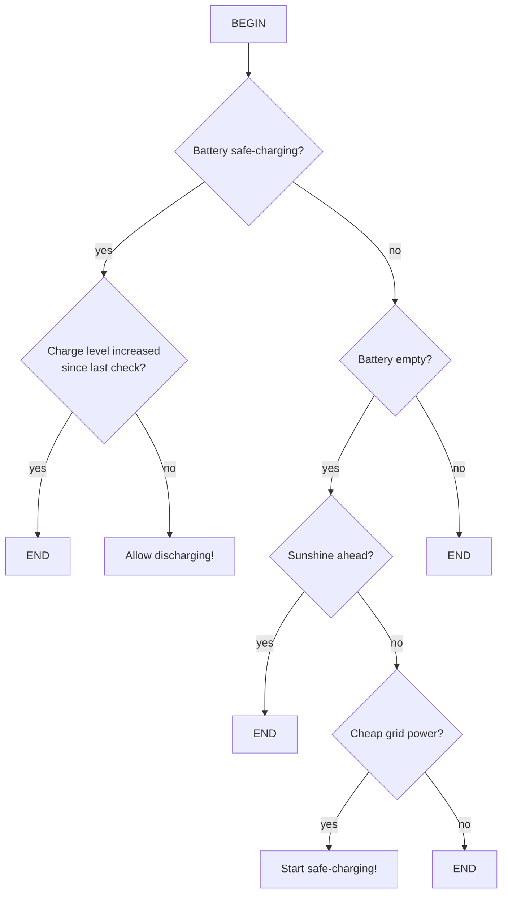

[](https://github.com/solectrus/senec-charger/actions/workflows/push.yml)
[](https://wakatime.com/badge/user/697af4f5-617a-446d-ba58-407e7f3e0243/project/018c5239-d626-4755-b81b-a7c7006ebabb)
[](https://codeclimate.com/repos/65775403feb13f15432f92cd/maintainability)
[](https://codeclimate.com/repos/65775403feb13f15432f92cd/test_coverage)

# SENEC Charger

Automated low-cost grid charging for SENEC Home V3 / V2.1 and Tibber dynamic electricity tariff

It charges your battery when electricity is cheap and there is no sunshine in sight.



## Requirements

- SENEC.Home V3 or V2.1
- Dynamic electricity tariff from [Tibber](https://tibber.com)

## Usage

1. Prepare an `.env` file (see `.env.example`)

2. Run the Docker containers on your Linux box:

   ```bash
   docker compose up
   ```

This setup uses the following other Docker services:

- [Tibber-Collector](https://github.com/solectrus/tibber-collector)
- [Forecast-Collector](https://github.com/solectrus/forecast-collector)
- [InfluxDB v2](https://hub.docker.com/_/influxdb)

## License

Copyright (c) 2023-2025 Georg Ledermann, released under the MIT License

Sponsored by [EP: Bölsche Frikom GmbH](https://www.ep.de/boelsche)
