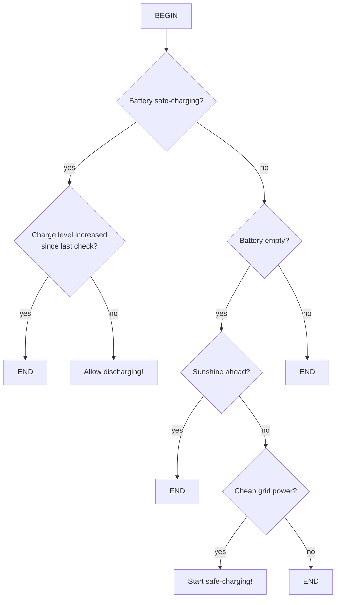

[](https://github.com/solectrus/senec-charger/actions/workflows/push.yml)
[](https://wakatime.com/badge/user/697af4f5-617a-446d-ba58-407e7f3e0243/project/018c5239-d626-4755-b81b-a7c7006ebabb)

# SENEC-Charger

Automated low-cost grid charging for SENEC Home V2/V3



## Usage

1. Make sure your InfluxDB database is ready (not subject of this README)

2. Prepare an `.env` file (see `.env.example`) with your InfluxDB credentials and IP address of your SENEC Home V2/V3

3. Run the Docker container on your Linux box:

   ```bash
   docker run -it --rm \
              --env-file .env \
              ghcr.io/solectrus/senec-charger:latest
   ```

It's recommended to integrate the `senec-charger` into your SOLECTRUS hosting. See more here:
https://github.com/solectrus/hosting

## License

Copyright (c) 2023 Georg Ledermann, released under the MIT License
Sponsored by [EP: Bölsche Frikom GmbH](https://www.ep.de/boelsche)
